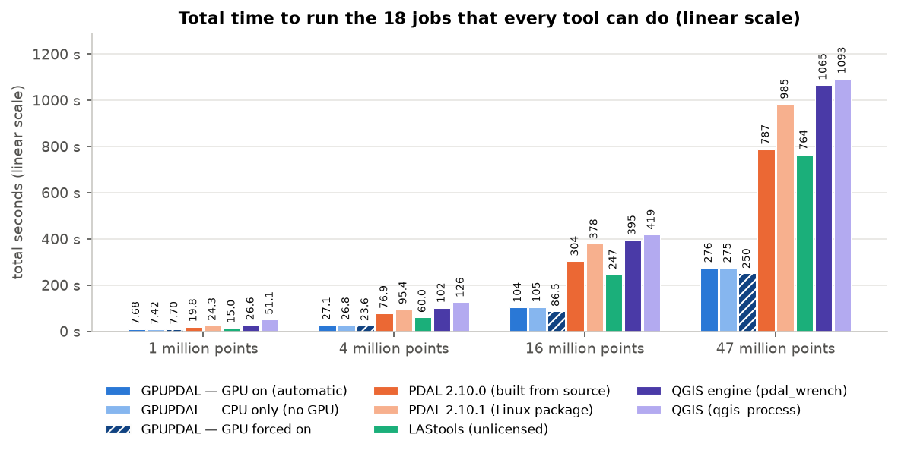

# GPUPDAL


GPUPDAL (GPU Point Data Abstraction Library) is an independent,
performance-focused point-cloud processing engine derived from PDAL. Its
public `gpupdal` command is a drop-in command-line replacement for `pdal`: it
accepts the same commands and pipelines, then chooses between exact CPU and
CUDA implementations using measured end-to-end performance.

The first binary's optional external plugins are disabled for a controlled,
portable dependency set. Drop-in behavior is preserved for the complete stage
catalog configured into that release: the bundle requires `gpupdal --drivers`
to match its sibling `pdal --drivers`, and unsupported acceleration falls back
to that exact PDAL implementation. Plugin source remains available for later
qualified artifacts and source builds.

Default mode prioritizes reproducibility. Deterministic outputs must match the
frozen reference bytes; inherently nondeterministic containers are
canonicalized and compared semantically. An accelerated path that cannot meet
that contract declines to the exact host path instead of weakening the
default. See the [conformance suite](docs/conformance.md),
[stage coverage](docs/stage-coverage.md), and
[testing strategy](docs/testing-strategy.md) for the precise contracts.

## Quick start

```sh
gpupdal pipeline pipeline.json
gpupdal translate input.laz output.laz
gpupdal doctor
```

## Profile this machine

Run calibration to measure exact CPU and GPU paths and write a machine-local
placement profile:

```sh
gpupdal calibrate
```

For placement tuned to representative data, supply a LAS or LAZ file:

```sh
gpupdal calibrate --input /path/to/tile.laz --points 250000,1000000,4000000
```

GPUPDAL then uses the profile automatically, selecting the GPU only where it
measured a complete-process win. Inspect the active profile with
`gpupdal calibrate --status`, or preview the calibration plan with
`gpupdal calibrate --dry-run`. The default profile location is
`~/.config/gpupdal/placement-profile.json`. See the
[calibration guide](docs/calibration.md) for quick runs, selected models,
custom output paths, and invalidation rules.

## Verify and benchmark GPUPDAL

Run the portable verification benchmark to compare the installed `gpupdal`
binary with the configured frozen reference on the same machine. It performs
one warm-up followed by three alternating complete-process timing pairs,
checks exactness, and writes portable JSON and HTML evidence:

The optional verifier requires Python 3 on `PATH`. Ordinary PDAL-compatible
commands do not require Python.

```sh
gpupdal verify --output-dir gpupdal-proof
```

To use representative data and a pipeline of your own, use `input.laz` and
`output.laz` as the pipeline's input and output placeholders:

```sh
gpupdal verify --input /path/to/tile.laz --pipeline /path/to/pipeline.json \
  --runs 3 --warmups 1 --output-dir gpupdal-proof
```

Publishing the resulting `gpupdal-proof` directory lets another person audit the
machine, binary and input hashes, placement decision, exactness result, and raw
timings. An author-run report is prepared evidence; it becomes third-party
validation only when an unrelated user runs and publishes it. See the full
[`gpupdal verify` guide](docs/verification.md).

## Benchmark snapshot



Lower is better. Each bar is the summed median wall-clock time for the 18 jobs
that every compared tool completed at every input size on the reference
workstation. The y-axis starts at zero and is linear. This is an author-produced
comparative run, not third-party validation; LAStools ran unlicensed and some
tools use different algorithms for similarly named jobs. See the
[full benchmark report](docs/reports/pdg-independent-benchmark.pdf) for methods,
per-job results, hardware, repeat counts, and limitations.

## npm installation status

The repository contains the release-safe scaffold for the intended install
experience:

```sh
npm install gpupdal
npx gpupdal --version
```

Use `npm install --global gpupdal` when you want `gpupdal` directly on your
shell path.

`gpupdal@0.1.0` is public on npm's `latest` channel. The release carries CUDA
13 artifacts for Linux x86-64 and Windows x64. The small `gpupdal` launcher
selects exact-version native support packages automatically; users still run
only `npm install gpupdal`. Compute
capability 8.9 exactness
and CUDA execution are physically qualified on an RTX 4090 with driver
610.43.03 on Linux and an NVIDIA L4 with driver 610.88 on Windows; driver 580
or newer is required. The measured automatic-acceleration promise currently
applies to the Linux RTX 4090 profile. Windows is qualified for exact CUDA
execution, but not yet for a speedup or automatic-selection claim. Other
cubins in the portable binaries are not advertised as stable until their
physical fixed-bit lanes pass. See
[packages/npm/README.md](packages/npm/README.md) and
[RELEASE_READINESS.md](RELEASE_READINESS.md). Releases are built and checked
locally; the repository does not require GitHub Actions. See the
[manual release guide](docs/releasing.md).

Installation itself does not hard-fail on an unsupported or absent GPU. The
command can use its exact CPU/PDAL fallback there, but the stable acceleration
promise is limited to the physically qualified SM 89 profile.

## Development status

GPUPDAL is under active development. Runtime and differential-test coverage are
mature, while packaging, APIs, optional integrations, naming, and release
conformance continue to be tracked explicitly:

- [Stage coverage](docs/stage-coverage.md) separates functional, native,
  performance-qualified, and automatically selected coverage.
- [Implementation plan](IMPLEMENTATION_PLAN.md) records remaining release
  work and acceptance gates.
- [Benchmarks](BENCHMARKS.md) and [decisions](DECISIONS.md) contain the
  append-only engineering evidence.
- [Reports](docs/reports/README.md) index the reproducible public evidence
  packages.

## Build

The maintained developer presets are documented in [AGENTS.md](AGENTS.md). A
typical host build starts with:

```sh
cmake --preset pdg-host-debug
cmake --build --preset pdg-host-debug
ctest --preset pdg-host-debug
```

CUDA builds require CUDA 12.4 or newer and use the public
`GPUPDAL_ENABLE_CUDA` CMake option. Runtime acceleration is conservative:
when a device, pipeline, layout, or performance profile is not qualified,
GPUPDAL uses the exact host implementation.

## License and contributing

GPUPDAL is distributed under the BSD 3-Clause license except where a bundled
component states different terms. See [LICENSE.txt](LICENSE.txt),
[NOTICE](NOTICE), [ORIGIN.md](ORIGIN.md), and the
[third-party inventory](THIRD_PARTY_LICENSES.md) for retained copyright,
provenance, and third-party notices.

The GPUPDAL-specific BSD non-endorsement clause explicitly protects the names
GPUPDAL, Zy Mazza, and Automagics: derived products may not use those names to
imply endorsement or promotion without prior written permission. It does not
prohibit truthful attribution, compatibility statements, or commercial use.

GPUPDAL is provided **AS IS**, without warranties or a support commitment. The
five-business-day security/contact acknowledgement target is a best-effort
project goal, not an SLA, warranty, or promise to provide a fix.

Contributions are welcome. Start with [CONTRIBUTING.md](CONTRIBUTING.md), which
describes the exactness, testing, and benchmark requirements for changes.
